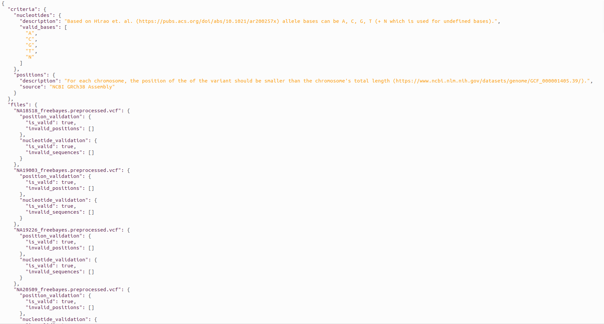
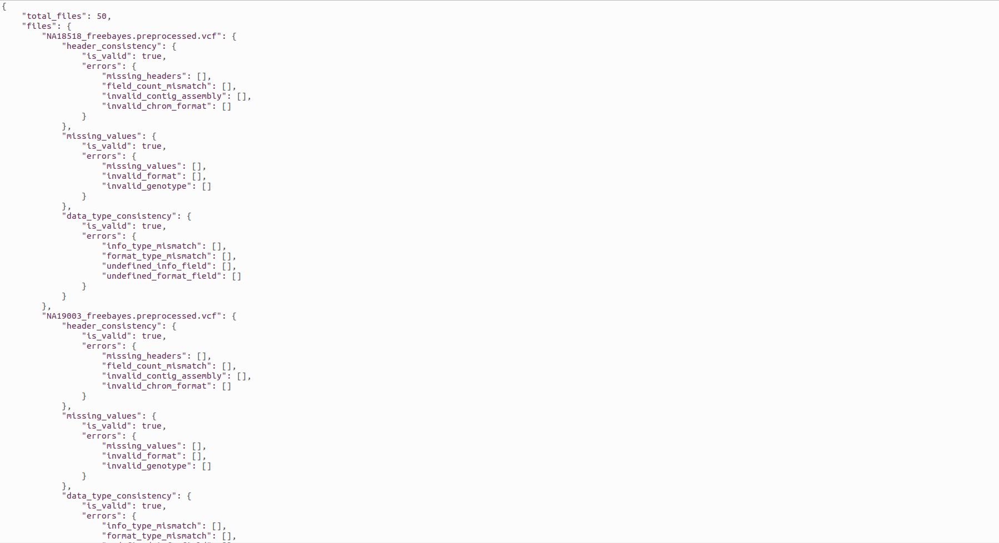
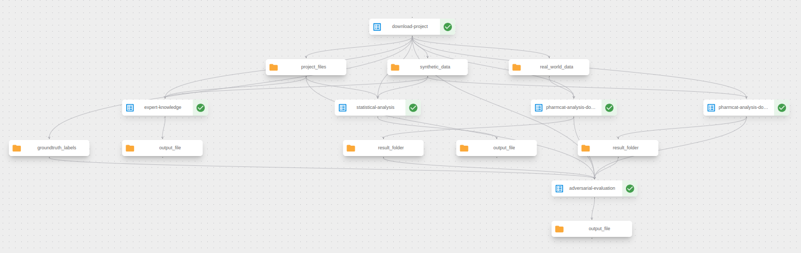

# REALM Task 5.1 Post-Market Evaluation

## General Task Description

Components developed in Task 5.1 focus on the post-market evaluation of synthetically generated medical data that are used in various medical applications such as lung tumor segmentation, pharmacogenomics, COPD prediction, etc.

The post-market evaluation is performed to ensure that the synthetic data generated is of high quality and is similar to the real data. To evaluate the quality of the synthetic data, examination along three main axes is performed:

1. **Expert Knowledge**: Evaluates the synthetic data based on domain-specific rules and medical knowledge to ensure anatomical correctness and clinical validity.
2. **Statistical Analysis**: Examines statistical and distributional properties of the synthetic data compared to ensure their validity from a statistical standpoint.
3. **Adversarial Evaluation**: Compares the performance of SOTA machine/deep learning models on the synthetic data with their performance on the real data to ensure that the two datasets (real and synthetic) yield comparable results.

## Use Case 2 Specific Description

This repository implements a comprehensive post-market evaluation pipeline for synthetic pharmacogenomics data in VCF format, analyzing their quality and similarity to real data through three distinct evaluation approaches:

**Key Components:**

- **Expert Knowledge Evaluation**: Evaluates the feasibility of the variants included in the VCF files based on the two following rules:
  - The valid values for the bases in the reference (REF) and alternative (ALT) sequences are A (adenine), T (Thymine), C (Cytosine), G (Guanine), and N (for cases where the base is unknown), based on standard literature as concluded in [Hirao et. al. (2024)](https://pubs.acs.org/doi/abs/10.1021/ar200257x).
  - The position of each variant, as it appears in column POS in the VCF, should be within the examined chromosome. That means that the value in POS should be smaller than the total length of the chromosome at hand. The total lengths of chromosomes for the utilized GRCh38.p13 genome assembly can be found [here](https://www.ncbi.nlm.nih.gov/datasets/genome/GCF_000001405.39/).

- **Statistical Analysis**: Conducts a thorough validation of VCF files by:
  - Verifying header consistency (mandatory headers, field counts, contig assembly format)
  - Validating chromosome format (must follow "chr##" pattern)
  - Checking data type consistency in INFO and FORMAT fields against header definitions
  - Ensuring no missing values in critical columns (CHROM, POS, REF, ALT)
  - Validating genotype data format and structure (FORMAT column starts with GT, proper genotype notation)
  - Confirming all data lines are properly TAB-delimited with consistent field counts

- **Adversarial Evaluation**: Compares classification performance for predicting pharmacogenomic phenotypes when using real and synthetic VCF files for the following key pharmacogenes: CYP2B6, CYP2C9, CYP2C19, CYP3A5, SLCO1B1, TPMT, and DPYD. Specifically, it uses:
  - PharmCAT as a SOTA model for predicting pharmacogenomic phenotypes
  - Accuracy, Precision, Recall, and F1-Score for quantitative comparison
  - Detailed difference analysis between original and synthetic results

## Getting Started

### Prerequisites

- Python 3.10
- Docker (for running PharmCAT)
- Required Python packages (install via `pip install -r requirements.txt`)

### Data Preparation

Place all data to be used in a folder named ```data``` with the following structure:
- `data/`
  - `groundtruth/groundtruth_phenotype_filtered.csv`: Groundtruth labels for the corresponding VCF files
  - `rwd_vcf/`: Subfolder containing the VCF files corresponding to the real-world data (RWD)
  - `synthetic_vcf/`: Subfolder containing the VCF files corresponding to the synthetically generated data

## Running Locally

1. **Download Dataset:** Download the provided dataset and place the relevant files in the ```data``` as explained in the Data Preparation subsection.
2. **Download PharmCAT Docker Components:** Download the necessary tools and scripts.
3. **Setup Execution Environment:**
   1. Create a folder called `pharmcat_execution` and unzip all files downloaded from step 2. into it. 
   2. Inside the `data` folder, place all `.vcf` files downloaded from step 1 following the expected structure for the `data` forlder as described above.
4. Navigate inside the `pharmcat_execution` directory and execute: `docker build -t pharmcat-realm .`
5. Execute PharmCAT for the real-world data: `docker run -v <absolute_path_to_real_data_folder>:/data -v <absolute_path_to_result_folder>:/result pharmcat-realm --input_folder /data --result_folder /result`.
6. Execute PharmCAT for the synthetic data: `docker run -v <absolute_path_to_synthetic_data_folder>:/data -v <absolute_path_to_result_folder>:/result pharmcat-realm --input_folder /data --result_folder /result`.

Steps 5 and 6 will execute the pharmcat pipeline for all samples in the specificed folder. The `result` folder will contain `phenotype.json` files for each sample and a total `phenotypes.csv` file containing the output in the format:

| Sample ID | CYP2B6 | CYP2C19 | CYP2C9 | CYP3A5 | DPYD | SLCO1B1 |     TPMT      |
|:---------:|:------:|:-------:|:------:|:------:|:----:|:-------:|:-------------:|
|  HG00276  |   RM   |   NM    |   IM   |   PM   |  NM  |   DF    | INDETERMINATE |
|  HG00436  |   IM   |   NM    |   NM   |   PM   |  NM  |   NF    |      NM       |

7. In the `data` folder, create a subfolder named `rwd_results` and put in it the the `phenotypes.csv` file originally in the results folder generated for the real-world data.
8. In the `data` folder, create a subfolder named `synthetic_results` and put in it the the `phenotypes.csv` file originally in the results folder generated for the synthetic data.
9. Perform the expert knowledge evaluation by running:

```
python3 expert_knowledge.py --input_dir "data/synthetic_vcf/"
```

The output of this evaluation is a JSON file saved in the `artifacts` folder with the following format:


10. Perform the statistical analysis evaluation by running:

```
python3 statistical_analysis.py --input_dir "data/synthetic_vcf/"
```

The output of this evaluation is a JSON file saved in the `artifacts` folder with the following format:


11. Perform the adversarial evaluation by running:

```
python3 adversarial_evaluation.py --groundtruth_file "data/groundtruth/groundtruth_phenotype_filtered.csv" --rwd_predictions_file "data/rwd_results/phenotypes.csv" --synthetic_predictions_file "data/synthetic_results/phenotypes.csv"
```

The output of this evaluation is a JSON file saved in the `artifacts` folder with the following format:


## Kubeflow Pipeline Component

The `kubeflow_component/post_market_evaluation_component.py` file defines a Kubeflow pipeline for automating the workflow for the post-market evaluation of synthetically generated pharmacogenomics data. This pipeline orchestrates the following components:

1. **Download Component**: Downloads project files, real-world and synthetic data along with the corresponding ground truth labels from a specified GitHub repository. The pipeline expects the repo to contain the `data/` folder at its root with all required files placed inside.
2. **Expert Knowledge Evaluation**: Executes the expert knowledge step of the post-market evaluation based on the described expert criteria.
3. **Statistical Analysis**: Executes the statistical analysis checks based on the defined statistical criteria.
4. **PharmCAT Analysis for real-world data**: Executes the PharmCAT analysis in a Docker container, processing VCF files corresponding to real-world data and generating phenotype predictions.
5. **PharmCAT Analysis for synthetic data**: Executes the PharmCAT analysis in a Docker container, processing VCF files corresponding to synthetic data and generating phenotype predictions.
6. **Adversarial Evaluation**: Utilizes the generated predictions for real-world and synthetic data from PharmCAT to perform the adversarial evaluation step.

**IMPORTANT:** You need to modify the `pharmcat_analysis_docker` function in the `post_market_evaluation_component.py` file to specify your PharmCAT Docker image:

```python
# Replace this:
image="<your_docker_pharmcat_image>",

# With your actual Docker image, for example:
image="docker.io/username/pharmcat-realm:latest",
```

After configuring the Docker image, the pipeline can be compiled and deployed to a Kubeflow environment by executing:

```
python3 .\kubeflow_component\post_market_evaluation_component.py
```

and then uploading the generated YAML file to the Kubeflow UI.
The Kubeflow UI expects one pipeline argument when running:
* `github_repo_url`, the repo that contains the data and python scripts.

The pipeline structure can be seen in the image below:


## Accessing the Generated Artifacts

The pipeline stores generated artifacts in MinIO object storage within the Kubeflow namespace. To access these artifacts:
1. Set up port forwarding to the MinIO service by running `kubectl port-forward -n kubeflow svc/minio-service 9000:9000` in a terminal window
2. Access the MinIO web interface at `http://localhost:9000`
3. Log in with the default credentials: **username:** `minio`, **password:** `minio123`
4. Navigate to the `mlpipeline` bucket, where you'll find the respective folders according to the automatically assigned uuid of the pipeline.

## 📜 License & Usage

All rights reserved by MetaMinds Innovations.
